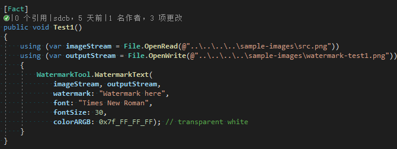
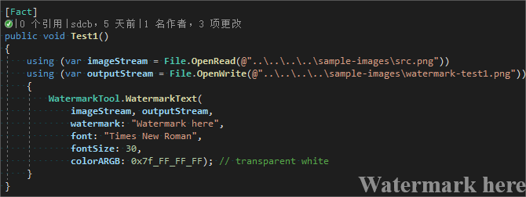

# Sdcb.Imaging [](https://www.nuget.org/packages/Sdcb.Imaging)
Direct2D based watermark/captcha tool.

# Watermark usage
```csharp
using (var imageStream = File.OpenRead(@"..\..\..\..\sample-images\src.png"))
using (var outputStream = File.OpenWrite(@"..\..\..\..\sample-images\watermark-test1.png"))
{
    WatermarkTool.WatermarkText(
        imageStream, outputStream,
        watermark: "Watermark here",
        srcImageFormat: ImageFormats.Png,
        font: "Times New Roman",
        fontSize: 30,
        colorARGB: 0x7f_FF_FF_FF); // transparent white
}
```

Origin image: 



Watermarked image:



# Captcha usage
```csharp
byte[] pngBytes = CaptchaTool.CreatePngImage(
    width: 200, height: 100, 
    fontSize: 50.0f, 
    text: "CAPTCHA", 
    font: "Times New Roman", 
    lineCount: 5, 
    rotation: false, 
    turbulenceAmount: 60.0f);
File.WriteAllBytes(
    @"..\..\..\..\sample-images\captcha-test1.png", pngBytes);
```

Generated example:


# Release Notes:

## 1.2.0
Add `ImageFormats` support in WatermarkTool, supported ImageFormats:
```csharp
public enum ImageFormats
{
    Bmp,
    Png,
    Ico,
    Jpeg,
    Tiff,
    Gif,
    Wmp,
    Dds,
    Adng,
}
```

Example: 
```csharp
var bytes = WatermarkTool.WatermarkText(
    imageStream: File.OpenRead(@"..\..\..\..\sample-images\src.jpg"),
    watermark: "Watermark here",
    srcImageFormat: ImageFormats.Jpeg, // read imageStream as jpeg format.
    destImageFormat: null,             // (optional) same format as src, can be specified,
    font: "Times New Roman",
    fontSize: 30,
    colorARGB: 0x7f_FF_FF_FF); // transparent white
File.WriteAllBytes(@"..\..\..\..\sample-images\watermark-dest.jpg", bytes);
```

## 1.1.0
Initial Version.
